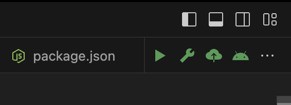

# VSCode Visual shortcut command button

Conveniently run your node project like an IDE

## Features

When the project is a node project and there is a script command for packagejson, the following four buttons can be quickly associated：
* npm start
* npm run build
* npm run publish
* npm run build:android

> Tip: 
You need to create these four npm scripts yourself

## Extension Settings

This extension currently has no settings.

## Known Issues

There are currently no known issues.

## Release Notes

### 1.0.0

Initial release.
