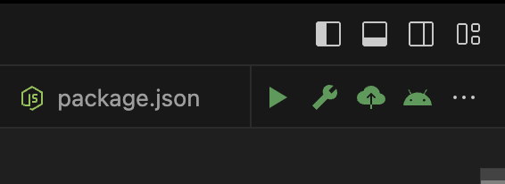
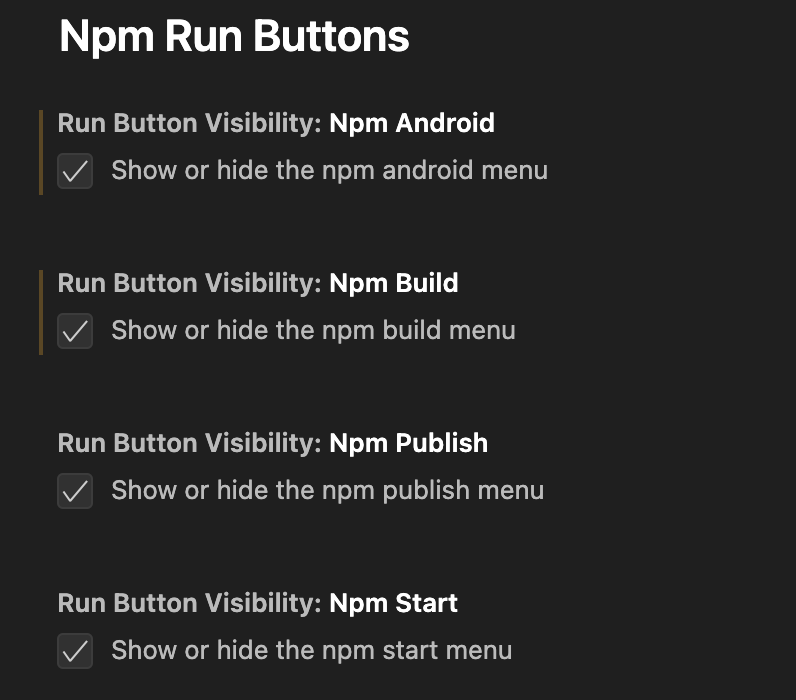

# VSCode visual shortcut command button

Conveniently run your node project like an IDE.

## Features

When the project is a node project and there is a script command for packagejson, the following four buttons can be quickly associated：
* npm start
* npm run build
* npm run publish
* npm run build:android

> Tip: 
You need to create these four npm scripts yourself.

> Another Tip:  
With my plugin installed, your VSCode will surpass IDEA and Android Studio, and directly compete with all JetBrains products!

## Extension Settings

Now you can control the visibility of the run buttons.

## Known Issues

There are currently no known issues.

## Release Notes

### 1.0.0

Initial release.

### 1.0.1

Update Readme.md.

### 1.0.2

Create a NEW terminal to run.

### 1.0.3

Update Readme.md.

### 1.0.4

Name a new shell title according to the script.

### 1.0.5

Config the visibility of the run buttons.
